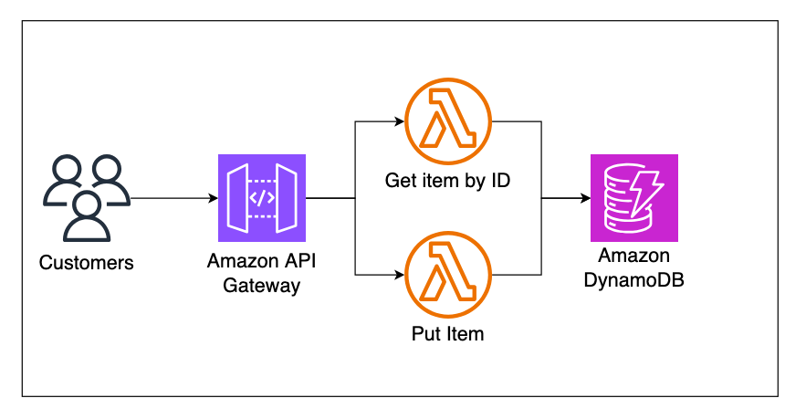
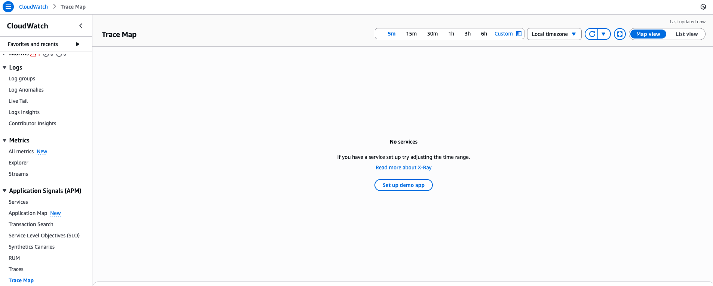
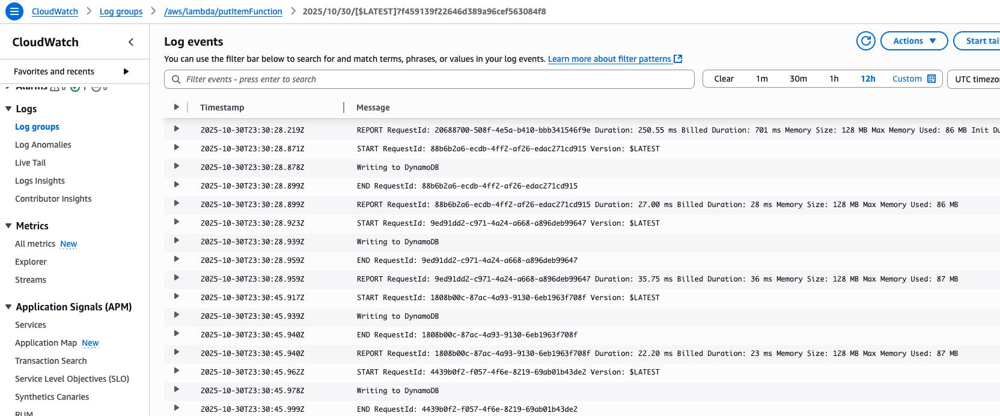
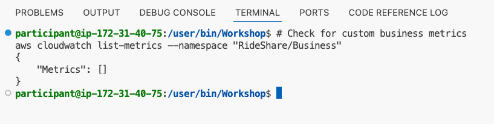

## Scenario

You have inherited a serverless ride-sharing application that was **developed without any observability**. The application consists of two Lambda functions (putItemFunction, getByIdFunction), an API Gateway, and a DynamoDB table. 

While the application works functionally, your **organization's requirements** have evolved. A collaboration between your customer and your observability team has resulted in comprehensive observability goals that must now be implemented.

## Application Architecture

The ride share application used in this workshop consists of serverless services such as Amazon API Gateway, AWS Lambda, and Amazon DynamoDB.

For simplicity we are using just two AWS Lambda functions. One Lambda function to insert an Item into a DynamoDB table, and another function to retrieve it using the appropriate unique ID.



## The Challenge

**Operations teams** and **business stakeholders** are struggling because the current application provides no visibility into:

* Request flow across services
* Tenant-specific usage patterns
* Business KPIs and operational metrics 
* Error tracking and performance bottlenecks 

This lack of observability creates significant business and operational challenges that must be addressed.

## Organizational Requirements Discovery

To address this, your **organization** has created specific observability goals and requirements. These represent real-world organizational standards that must be implemented across all applications.

**Review the requirements** 

```yaml
# Organizational Observability Requirements
observability_standards:
  distributed_tracing:
    - Enable X-Ray tracing on all Lambda functions
    - Capture downstream service calls
    - Include correlation IDs in all traces
  
  structured_logging:
    - JSON format for all log entries
    - Include tenant attribution for multi-tenant applications
    - Correlation IDs for request tracking
    
  business_metrics:
    - Custom CloudWatch metrics for key business operations
    - Tenant-specific usage tracking
    - Performance and error rate monitoring
 
 .
 .
 .
 
```

These requirements will guide the observability implementation throughout this workshop.

## Explore Your Application Environment

Let's systematically explore the current application to understand exactly what observability gaps exist.

### 1. AWS X-Ray Trace Map - Missing

Navigate to the [CloudWatch console](https://us-east-1.console.aws.amazon.com/cloudwatch/home?region=us-east-1) and examine X-Ray tracing:

1. Click **Application Signals (APM)** in the left sidebar
2. Select **Trace Map**
3. Observe the results



**Gap Identified**: No distributed tracing data because X-Ray instrumentation is not implemented in the application code.

**Business Impact**: Cannot trace requests across services, making troubleshooting nearly impossible during incidents.


### 2a. Review CloudWatch Logs - Unstructured

Examine the current logging approach:

1. Navigate to the [CloudWatch console](https://us-east-1.console.aws.amazon.com/cloudwatch/home?region=us-east-1)
2. Click **Logs** → **Log groups** in the left sidebar
3. Click on `/aws/lambda/putItemFunction` log group
4. Open the most recent log stream




### 2b. Tenant Attribution - Missing

**Gap Identified**: No easy way to identify tenant usage despite multi-tenant application architecture.

**Business Impact**: Cannot track usage per tenant, making cost allocation and customer-specific analytics impossible.


### 3. Custom Metrics - Missing

Now switch to your **VS Code Server terminal** to check for business-specific metrics in CloudWatch:

```bashshowCopyAction=true showLineNumbers=true language=bash}
# Check for custom business metrics
aws cloudwatch list-metrics --namespace "RideShare/Business"
```



**Gap Identified**: No custom business metrics exist for ride operations, tenant usage, or application-specific KPIs.

**Business Impact**: No visibility into business performance, customer usage patterns, or operational efficiency.


## Examine Application Code Structure

Let's look at the actual Lambda function code to understand the current implementation:

1. Navigate to the [Lambda console](https://us-east-1.console.aws.amazon.com/lambda/home?region=us-east-1#/functions)

2. Click on **putItemFunction** and examine the code:

```python
import os
import json
import boto3
import logging
from datetime import datetime
import base64

# Initialize the DynamoDB client
dynamodb = boto3.resource('dynamodb')
tableName = os.environ['SAMPLE_TABLE']
table = dynamodb.Table(tableName)

def lambda_handler(event, context):
    try:
        if event.get('isBase64Encoded'):
            record = base64.b64decode(event["body"]).decode('utf-8')
        else:
            record = event["body"]

        data = json.loads(record)

        id = data["id"]
        name = data["name"]
        milesTraveled = data["milesTraveled"]
        totalTravelTime = data["totalTravelTime"]
        price = data["price"]
        tenantId = data["tenantId"]
        timestamp = datetime.now().isoformat(timespec='seconds')

        data = 
        # Write the item to DynamoDB
        response = table.put_item(
            Item=data
        )
        print ("Writing to DynamoDB")

        return {
            'statusCode': 200,
            'body': 'Item added successfully'
        }
    except Exception as e:
        return {
            'statusCode': 500,
            'body': f'Error: '
        }

```

3. Click on **getByIdFunction** and examine the code:

```python
import os
import json
import boto3

# Initialize the DynamoDB client
dynamodb = boto3.resource('dynamodb')
tableName = os.environ['SAMPLE_TABLE']
table = dynamodb.Table(tableName)

def lambda_handler(event, context):
    try:
        print (event)
        # Parse input from the event
        key = event['pathParameters']['id']
        print (key)
        # Retrieve the item from DynamoDB
        response = table.get_item(
            Key={
                'id': key  
            }
        )
        
        # Check if the item was found
        if 'Item' in response:
            item = response['Item']
            print (item)
            return {
                'statusCode': 200,
                'body': json.dumps(item)
            }
        else:
            return {
                'statusCode': 404,
                'body': 'Item not found'
            }
    except Exception as e:
        return {
            'statusCode': 500,
            'body': f'Error: '
        }
```

**🔍 Code Analysis - Observability Gaps Identified:**

| Issue | Current Code | Impact |
|-------|-------------|---------|
| **No Tracing** | Missing `from aws_xray_sdk.core import xray_recorder` | Cannot track requests across services |
| **Unstructured Logging** | `print("Writing to DynamoDB")` | Logs are not searchable or correlatable |
| **No Correlation IDs** | No request tracking mechanism | Cannot trace individual requests |
| **No Custom Metrics** | No `cloudwatch.put_metric_data()` calls | No business KPI visibility |
| **Missing Tenant Context** | `tenantId` extracted but not logged | Cannot track per-tenant usage |
| **No Error Instrumentation** | Basic exception handling only | Limited error tracking and alerting |


## Organizational Requirements Gap Analysis

Comparing current state against organizational requirements:

| Requirement | Current State | Gap |
|-------------|---------------|-----|
| **X-Ray Tracing** | None | ❌ Complete gap |
| **Structured Logging** | Basic print() | ❌ Complete gap |
| **Tenant Attribution** | Missing | ❌ Complete gap |
| **Custom Metrics** | None | ❌ Complete gap |
| **Correlation IDs** | Missing | ❌ Complete gap |
| **Cost Targets** | Unknown costs | ❌ No visibility |


## What's Next

The observability gaps you've identified represent exactly the challenges that **Ollyver** is designed to solve. In the next module, you'll meet Ollyver - your AI observability agent that will:

1. **Automatically detect** these same gaps through code analysis
2. **Implement organizational standards** using proven patterns  
3. **Deploy changes** using your existing AWS infrastructure
4. **Validate** that observability improvements work correctly

Ollyver will transform this "black box" application into a fully observable system that meets all organizational requirements.

> **Note**: The gaps you manually discovered will be automatically detected and fixed by Ollyver in the next module.]
