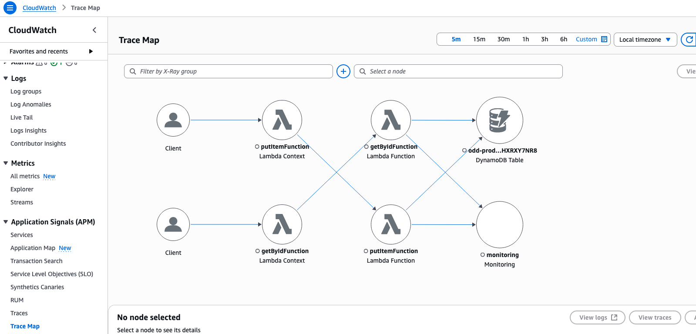
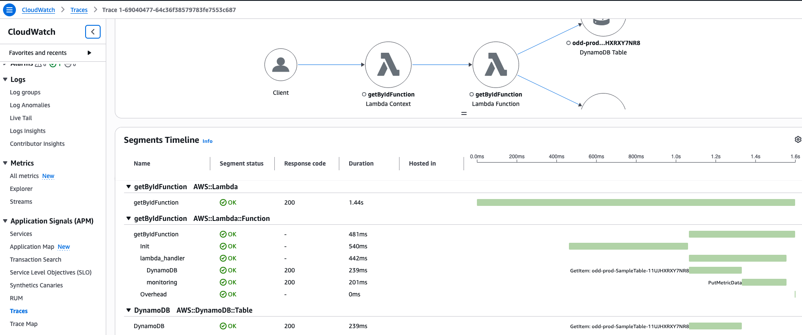
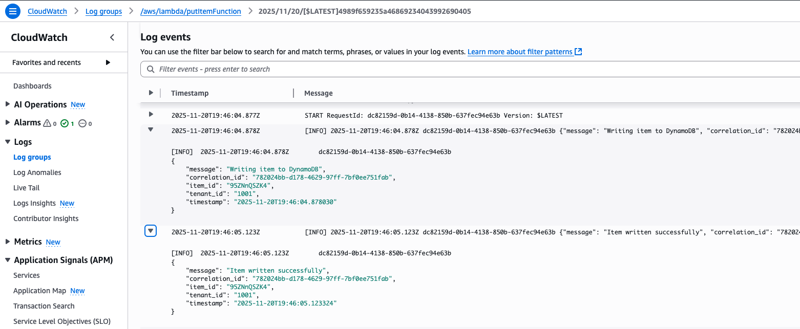
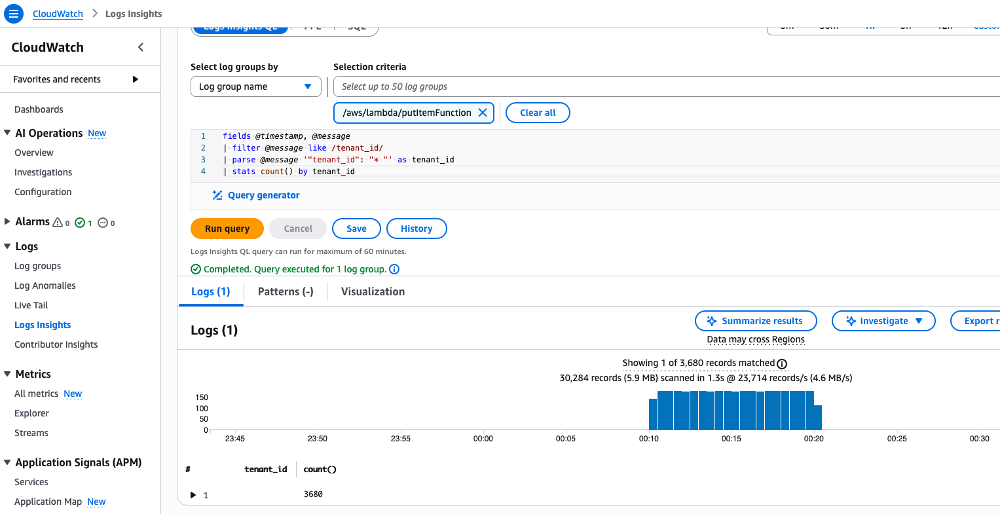
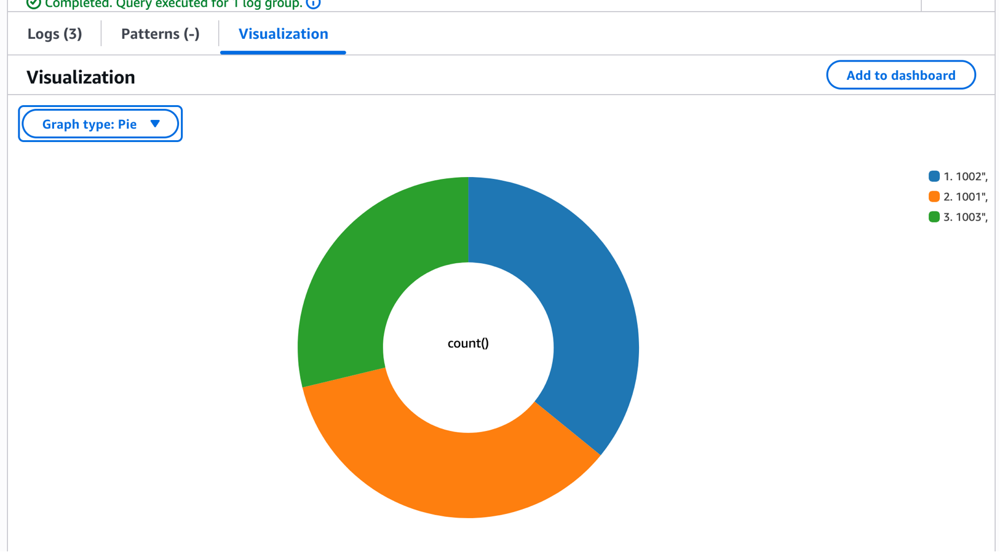

Now it's time to experience Ollyver in action! You'll watch as Ollyver automatically transforms your application from the "black box" you explored in Module 1 into a fully observable system with comprehensive observability.


### 1. Start Ollyver Analysis

In your VS Code Server with Kiro CLI active, begin the observability transformation:

```bashshowCopyAction=true}
I'm ready to implement observability.
```

**Expected Response:** Ollyver will present the patterns in priority order and ask which patterns you'd like to implement.

### 2. Select Patterns for Implementation

For this workshop, we'll focus on the 3 most essential observability patterns.

When Ollyver presents the pattern options, select the foundation patterns:

```bashshowCopyAction=true}
1, 2, 3
```

This will implement:
- **X-Ray Distributed Tracing**
- **Structured Logging**  
- **Business Metrics**

### 3. Confirm Implementation

Ollyver will confirm your selection and ask for final approval:

```bashshowCopyAction=true}
yes
```

### 4. Deploy Each Pattern

For each pattern implementation, Ollyver will ask whether to deploy to AWS. Always respond:

```bashshowCopyAction=true}
deploy
```

**Note:** Complete all three selected patterns by saying "yes" to continue and "deploy" for each pattern. 


> **Note**: Pay close attention to how Ollyver analyzes your code and provides detailed explanations for each implementation decision, including the specific changes it makes to your application]


## Pattern 2: Structured Logging

**Before Implementation**
Current unstructured logging:

```python
# putItemFunction.py - BEFORE
import json
import boto3

def lambda_handler(event, context):
    print("Writing to DynamoDB")
    # ... rest of function
```

**Ollyver's Structured Logging Implementation**

Ollyver automatically transforms logging to structured JSON format:

**After Implementation**

```python
import json
import logging
import uuid
from datetime import datetime

# Configure structured logger
logger = logging.getLogger()
logger.setLevel(logging.INFO)

@xray_recorder.capture('putItemFunction')
def lambda_handler(event, context):
    # Generate correlation ID
    correlation_id = str(uuid.uuid4())
    
    # Extract tenant information
    tenant_id = event.get('tenantId', 'unknown')
    
    # Structured logging with correlation and tenant attribution
    logger.info(json.dumps({
        'timestamp': datetime.utcnow().isoformat(),
        'correlation_id': correlation_id,
        'tenant_id': tenant_id,
        'operation': 'put_item',
        'message': 'Writing to DynamoDB',
        'request_id': context.aws_request_id
    }))
```


## Verify Observability Improvements in AWS Console

### Test the Enhanced Application

Generate traffic to see the new observability in action: **you can copy and paste below for your ollyver agent.**

```bashshowCopyAction=true}
# Test with tenant attribution
curl -X POST $(aws apigatewayv2 get-apis | jq '.Items[0].ApiEndpoint' | tr -d '"')/Prod/items \
  -d '{
    "id": "1a2b3c4d",
    "name": "first last",
    "milesTraveled": "12",
    "totalTravelTime": "600",
    "price": "13.32",
    "tenantId": "1001"
  }' -i

# Test retrieval run this 2 times
curl $(aws apigatewayv2 get-apis | jq '.Items[0].ApiEndpoint' | tr -d '"')/Prod/items/1a2b3c4d
```

### 1. Verify X-Ray Distributed Tracing

1. Navigate to [CloudWatch console](https://us-east-1.console.aws.amazon.com/cloudwatch/home?region=us-east-1)
2. Click **Application Signals (APM)** → **Trace Map**
3. **Wait a few seconds** for the trace data to populate, then you should see complete service map with Lambda functions and DynamoDB



4. Click **Traces** to see individual request flows
5. **Scroll down** in the traces page to see the list of traces
6. **Click on one of the traces** to see detailed timing and subsegment information



### 2a. Verify Structured Logging

1. Go to **CloudWatch** → **Log groups**
2. Open `/aws/lambda/putItemFunction` log group
3. Click on the most recent log stream. To open it and view
4. Search **DynamoDB** (case sensitive)

**Before (unstructured):**
```
Writing to DynamoDB
Item created successfully
```

**After (structured):**




### 2b. Structured logs for Tenant Attribution 
Now that structured logging includes tenant identifiers (as required by your organization), you can attribute logs, metrics, and alerts to specific tenants. Use the Log Insights query shown above to filter or aggregate by `tenant_id` for tenant-level usage, revenue, and error reporting. Ensure `tenant_id` is consistently included in all relevant log entries and metric dimensions to maintain accurate attribution for billing, monitoring, and alerts.


1. Go to **CloudWatch** → **Logs Insights**
2. Select the log group **`/aws/lambda/putItemFunction`**
3. Run tenant-specific queries:

```sql
fields @timestamp, @message
| filter @message like /tenant_id/
| parse @message '"tenant_id": "* "' as tenant_id
| stats count() by tenant_id
```



4. Click on the Visualization tab and choose Pie from the Widget type drop down. 
This is an example of how you can attribute tenant usage based on the log entries.




## Summary

You have successfully implemented all three observability patterns:

**X-Ray Distributed Tracing**: Complete request flow visibility across Lambda and DynamoDB  
**Structured Logging**: JSON format with tenant attribution and correlation IDs  
**Custom Business Metrics**: Real-time KPIs for ride requests, revenue, and errors by tenant  
**AWS Integration**: Real observability data flowing through CloudWatch and X-Ray  
**Automated Deployment**: Ollyver handled all code changes and AWS updates

## What's Next

In Module 4, you'll see how businesses can add requirements for compliance and how Ollyver can handle that seamlessly.


