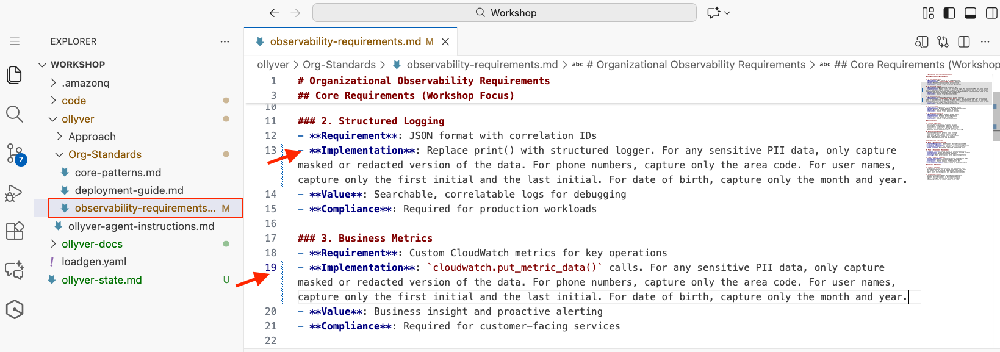
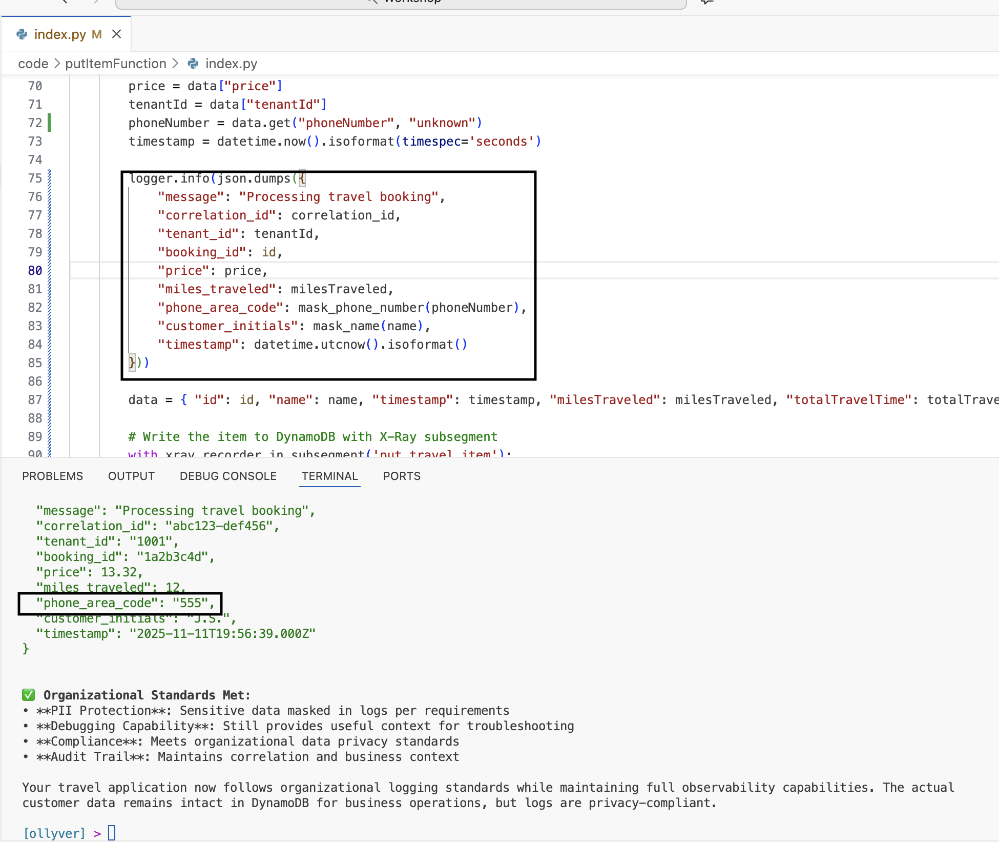

In this module, we will see how dynamically changing requirements can be defined for Ollyver to implement. 


Our application has a new requirement to capture phone numbers as part of ride requests. Simply ask Ollyver to update your code.
<br>
copy and paste the following in your agent chat window.

```bashshowCopyAction=true }
Navigate to **code/putItemFunction/index.py** and add the line to capture user phone number under tenantId

- Add line  where phoneNumber is extracted from request
- Update line where phoneNumber is added to the json object to be persisted. 
```

We will now guide Ollyver to capture this in our logs. On the surface, it seems like capturing phone number in logs and metrics is harmless. 

Navigate to Terminal and instruct [ollyver] to 'Update logging and metrics to capture phone number'

```bashshowCopyAction=true}
Update logging and metrics to capture phone number.
```

See Ollyver updates your code with the requirement and adds logging as per the standards. You can also see description with examples in the terminal on what ollyver has implemented. your response may vary. but it should be somewhat similar to the following.


While coding assistants can deliver code that meets general standards and best practices, organizations should define/refine standards to their specific needs. Best practices like logging non-identifying tokens instead of personal data, sanitizing and redacting sensitive information, are just a few examples. 

For the ride share application we have identified that capturing the area code is preferred as it will allow to do some geographical analysis while still being PII compliant. 

## Update Org Requirements 

Navigate to **ollyver/Org-Standards/observability-requirements.md** in your VS Code Server file explorer and update the Implementation for Structured Logging and Business Metrics.



Append the following instruction to Line 13 and Line 19. **Then save the file**.

```bashshowCopyAction=true showLineNumbers=false language=text}
For any sensitive PII data, only capture masked or redacted version of the data. For phone numbers, capture only the area code. For user names, capture only the first initial and the last initial. For date of birth, capture only the month and year.
```

The file should look something like this. 

```bashshowCopyAction=false showLineNumbers=true language=yaml}
### 2. Structured Logging  
- **Requirement**: JSON format with correlation IDs
- **Implementation**: Replace print() with structured logger. For any sensitive PII data, only capture masked or redacted version of the data. For phone numbers, capture only the area code. For user names, capture only the first initial and the last initial. For date of birth, capture only the month and year.
- **Value**: Searchable, correlatable logs for debugging
- **Compliance**: Required for production workloads

### 3. Business Metrics
- **Requirement**: Custom CloudWatch metrics for key operations
- **Implementation**: `cloudwatch.put_metric_data()` calls. For any sensitive PII data, only capture masked or redacted version of the data. For phone numbers, capture only the area code. For user names, capture only the first initial and the last initial. For date of birth, capture only the month and year.
- **Value**: Business insight and proactive alerting
- **Compliance**: Required for customer-facing services
```

> **Note**: These instructions were intentionally left out at the beginning of the workshop to demonstrate the default behavior of Ollyver. In a real-world scenario, these instructions would be predefined in the organizational standards and proactively applied to all feature development.]

We will now direct Ollyver to honor these Organizational standards. Navigate to Terminal and instruct [ollyver] to 'Update to follow organizational logging standards'

```bashshowCopyAction=true}
Update to follow organizational logging standards
```

After ollyver is finished processing, open **code/putItemFunction/index.py** and see the new masking logic. As shown in line 9 below, ollyver has updated its logic to extract the area code (first 3 digits) as desired.

```bashshowCopyAction=false showLineNumbers=true language=python}
        id = data["id"]
        name = data["name"]
        milesTraveled = data["milesTraveled"]
        totalTravelTime = data["totalTravelTime"]
        price = data["price"]
        tenantId = data["tenantId"]
        phoneNumber = data.get("phoneNumber", "unknown")
        # Mask phone number for logging - only capture area code per org standards
        masked_phone = phoneNumber[:3] + "***" if phoneNumber != "unknown" and len(phoneNumber) >= 3 else "unknown"
        timestamp = datetime.now().isoformat(timespec='seconds')
```

You can also see description with examples in the terminal on what ollyver has implemented. 



> **Note**: Optional: you can deploy this change to AWS and check the logs to see the masked phone numbers. You would also need to invoke a putItemFunction code with phone number included in it and then retrieve the relevant log. Ollyver can help with all these steps. But due to lack of time, let's move to the next module]
